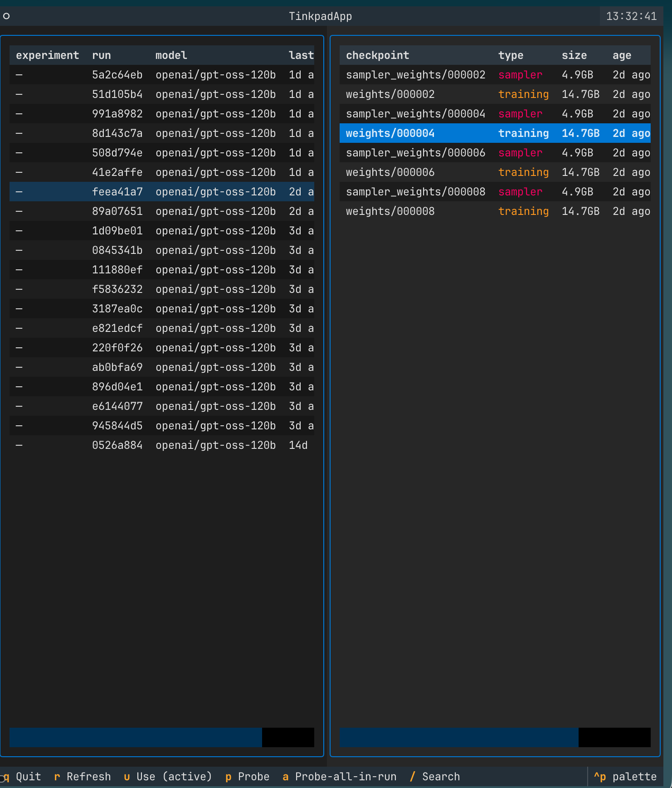

# tinkpad

> A beautifully-designed wrapper around [Tinker](https://thinkingmachines.ai/tinker/) for browsing, probing, and copying checkpoint URIs across all your experiments.



The official `tinker` CLI lists runs and checkpoints but knows nothing about
*which local experiment folder produced which run*, and has no built-in way
to verify "is this checkpoint actually serving?". `tinkpad` adds both, plus
an interactive TUI where pressing `c` on any checkpoint copies its `tinker://`
URI to your clipboard.

## What's new in 0.3

- **`c` in the TUI copies the selected checkpoint URI to your clipboard** with a toast confirmation.
- **`use` / `active` removed** — the active-pointer / `~/.tinkpad/active.env` design is gone. Pick a checkpoint, copy it, paste into wherever you actually need it. Less indirection, fewer surprises.

## What's in 0.2 (still here)

- **Local metadata cache** — `~/.tinkpad/cache.json` keeps a snapshot of all run/checkpoint metadata so `ls`/`runs`/`tree` are instant and work offline. `tinkpad sync` refreshes.
- **`tinkpad tree`** — filesystem-style view: experiments are folders, runs are runners inside them, checkpoints are files inside those.
- **TUI rename inline** — press `n` on any run row to name it without leaving the TUI.
- **TUI panel switching** — `←` / `→` move focus between the runs pane and the checkpoints pane.
- **Unnamed runs flagged** — `[unnamed]` shows in dim red anywhere a run has no friendly name; `runs`/`tui` show a count.
- **`tinkpad reg name-unnamed`** — walk every unnamed run and name them one by one.
- **`from tinkpad import register_current_run`** — one-line Python helper to call from a training script so the run gets named at launch time.

## Features

- **`tinkpad ls`** — every checkpoint, every run, joined with the local
  experiment name from your `Zexp`/`Zlog/<run_id>/` folders.
- **`tinkpad probe <path>`** — fires one tiny inference request against the
  checkpoint's OpenAI-compatible endpoint; reports OK / fail / timeout +
  latency.
- **`tinkpad reg scan`** — walks `~/Developer` for `Zlog/<run_id>/` dirs
  and auto-registers `run_id → experiment-name`.
- **`tinkpad tui`** — Textual-based interactive browser. Two-pane layout,
  `←` `→` switch panels, `p` to probe, `c` to copy URI, `n` to rename, `/` to search.

## Install

```bash
cd ~/Developer/tinkpad
python3 -m venv .venv
.venv/bin/pip install -e .[dev]
```

Add to PATH:
```bash
export PATH="$HOME/Developer/tinkpad/.venv/bin:$PATH"
```

`TINKER_API_KEY` must be exported (e.g. `source ~/.local/secrets`).

## Quick start

```bash
tinkpad doctor                 # confirm API reachability
tinkpad reg scan -v            # auto-register experiment names from ~/Developer
tinkpad runs                   # list all training runs
tinkpad ls -s                  # list newest sampler ckpts per run (default: 3 each)
tinkpad ls --all               # flat list (no per-run grouping)
tinkpad ls -s -p               # also probe every sampler — slow but thorough
tinkpad info 5a2c6:final       # short prefix + step suffix work everywhere
tinkpad info @latest           # info on the newest sampler across all runs
tinkpad probe 5a2c6:30         # probe one
tinkpad probe --run 5a2c6      # probe every sampler in a run
tinkpad tui                    # interactive browser — press c to copy a URI
```

### Path resolution

Every command that takes a checkpoint accepts:
- A full URI: `tinker://abc...:train:0/sampler_weights/000010`
- Short prefix + step: `abc:final`, `abc:30`, `abc:000030`
- Short prefix alone: `abc` → newest sampler in that run
- An experiment name (after `reg scan`): `my-sft-run:final`
- `@latest` — the most-recently-created sampler across all runs

## TUI keys

| key             | action                                       |
| --------------- | -------------------------------------------- |
| `←` / `→`       | switch focus between runs pane and ckpts pane |
| `↑` / `↓`       | navigate within current pane                  |
| `c`             | **copy selected checkpoint URI to clipboard** |
| `p` / enter     | probe selected checkpoint                    |
| `a`             | probe every sampler in the current run       |
| `n`             | rename selected run (inline)                 |
| `/`             | search experiments / runs                    |
| `r`             | refresh from cache                           |
| `s`             | force-sync the cache                         |
| `q`             | quit                                         |

## File layout

```
~/.tinkpad/
  registry.json     # run_id → experiment-name mapping
  cache.json        # cached snapshot of runs + checkpoint metadata
  scan_roots.json   # which dirs to walk for auto-scan (default ~/Developer)
  scan.stamp        # mtime of last scan (TTL gate)
```
